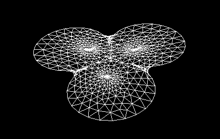
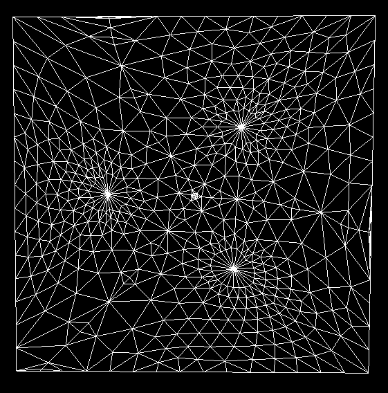
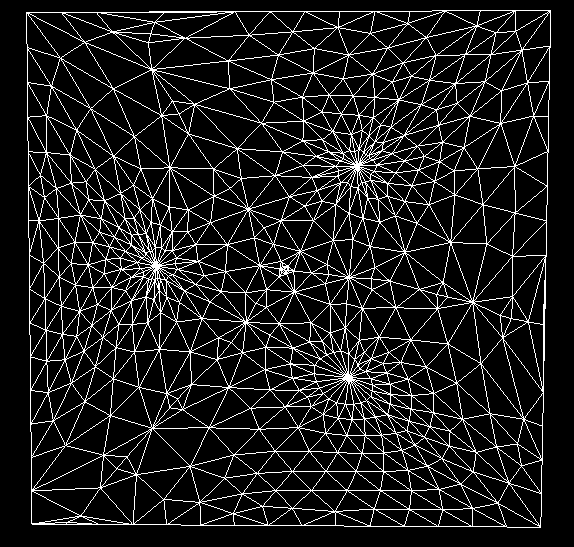
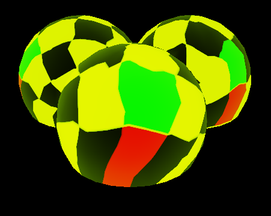
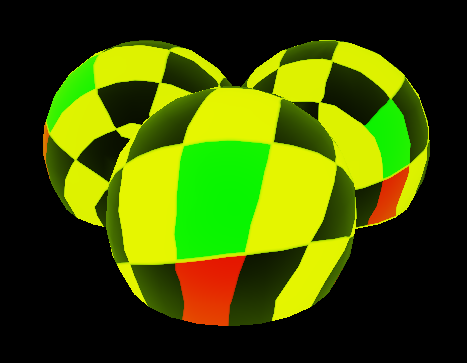

# USTC CG Lab 4 

Pb17111572 李缙

## 一、实验内容

- 完成极小曲面生成算法
- 完成网格参数化算法，其中权值计算有两种方式：
  - Uniform weight 
  - Cotangent weight
- 显示纹理映射结果

## 二、算法描述

### （一）极小曲面

- $$\delta_i=v_i-\frac{1}{d_i}\sum_{v\in N(i)}v=\frac{1}{d_i}\sum_{v\in N(i)}(v_i-v)=0$$

- 由于边界点固定，从而得到线性方程组

  $$\begin{equation}
  \left\{
  		\begin{array}{left}
  		Lx=\delta=0\\
  		x_i=v_i\; over\;Boundary   \\
  		\end{array}
  \right.
  \end{equation}$$

- 假设共有n个顶点，m个边界点

- 通过带入m个点的坐标（即固定），即可构建(n-m)*(n-m)的系数矩阵，然后使用Eigen的LU分解来解方程

### （二）参数化

- 首先将边界固定到平面凸多边形（这里实现的是单位正方形）上
  - 通过将边界点按顺序均匀分布在单位正方形上
  - 前1/4的边界点均匀分布在$x=0(0\le y\le1)$

- 定义嵌入

  $$\begin{equation}
  \left\{
  		\begin{array}{left}
  		Wx=b_x\\
  		Wy=b_y  \\
  		\end{array}
  \right.
  \end{equation}$$

  其中

  $$w_{ij} = \left \{
  \begin{array}{l}
  <0 & (i,j)\in E\\
  -\sum_{j\neq i} w_{ij} & (i,i)\\
  0 & \text{otherwise}
  \end{array}
  \right.$$

- Uniform weight
  
  - $w_j = 1$ 
- Cotangent weight (geometry aware)
  
  -  $w_j =  (\cot \alpha + \cot\beta)$ 
- 之后便解方程和上述基本一致

## 三、代码框架

### （一）极小曲面

其中L_即为Modified laplace矩阵，维度为(n-m)*(n-m)

整体运算步骤分四步：

1. 找到边界点集
2. 构建内点集、获得m和n，构建矩阵L_
3. 求解
4. 更新

具体步骤见代码及其注释（很详细）

### （二）参数化

基本上和上述过程类似，为了实现两种方法，更改了面板，增加了按钮，分别是：

1. 按均匀Laplace参数化
2. 按cotangent Laplace参数化
3. 按均匀Laplace更新纹理
4. 按cotangent Laplace更新纹理

具体实现见代码及其注释（很详细）

## 四、实验结果

以Balls举例，

<figure class="fouth">
      
      
      
      
      
</figure>

上图中，从左到右分别为最小曲面结果、均匀Laplace参数化、CotLaplace参数化、均匀Laplace更新纹理、CotLaplace更新纹理。

操作流程见视频。

## 五、总结

这次实验的算法很简单，主要时间全花费在熟悉接口上，主要还是对于框架不熟悉且没有提供较详细的手册，希望之后能有所补充。