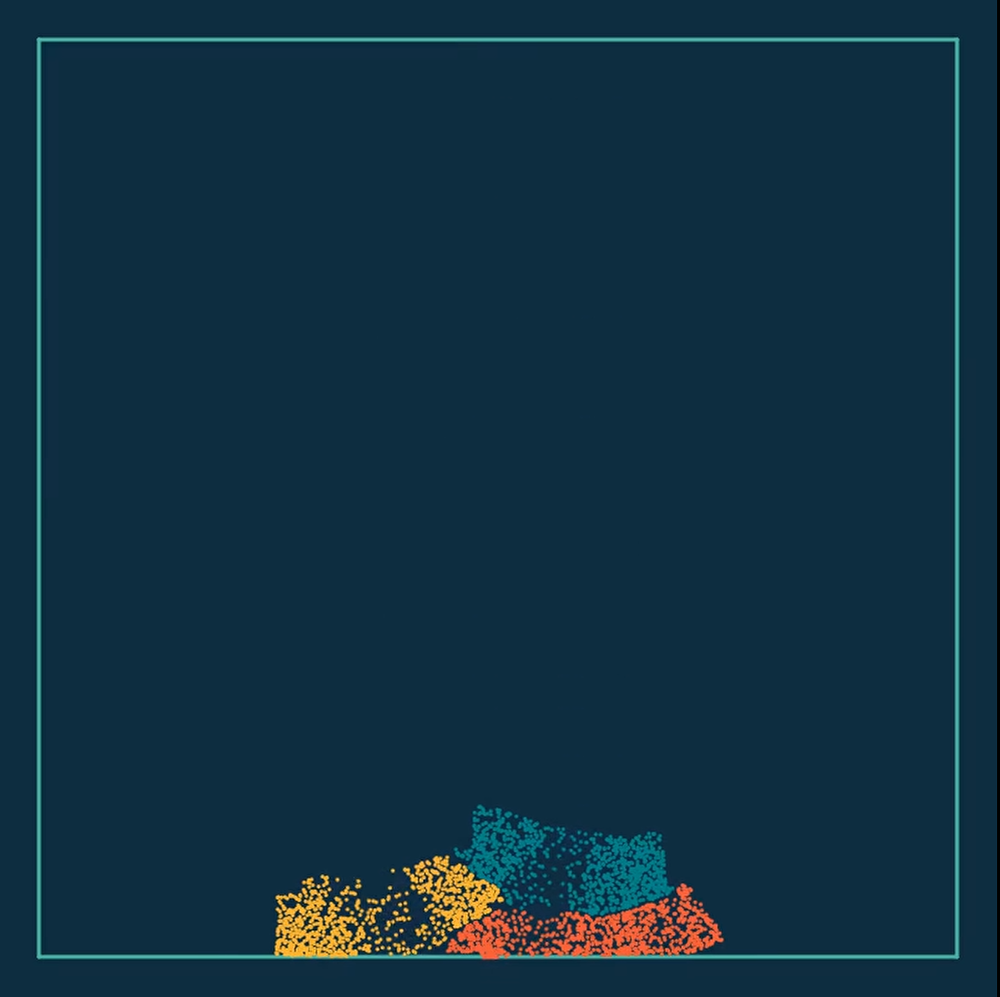
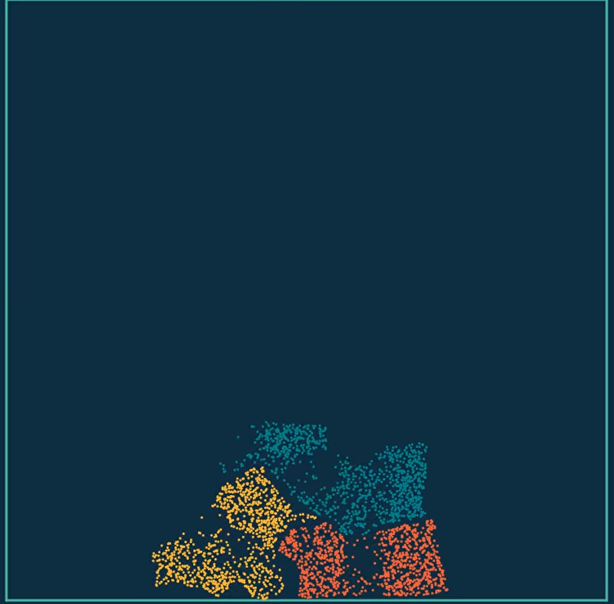
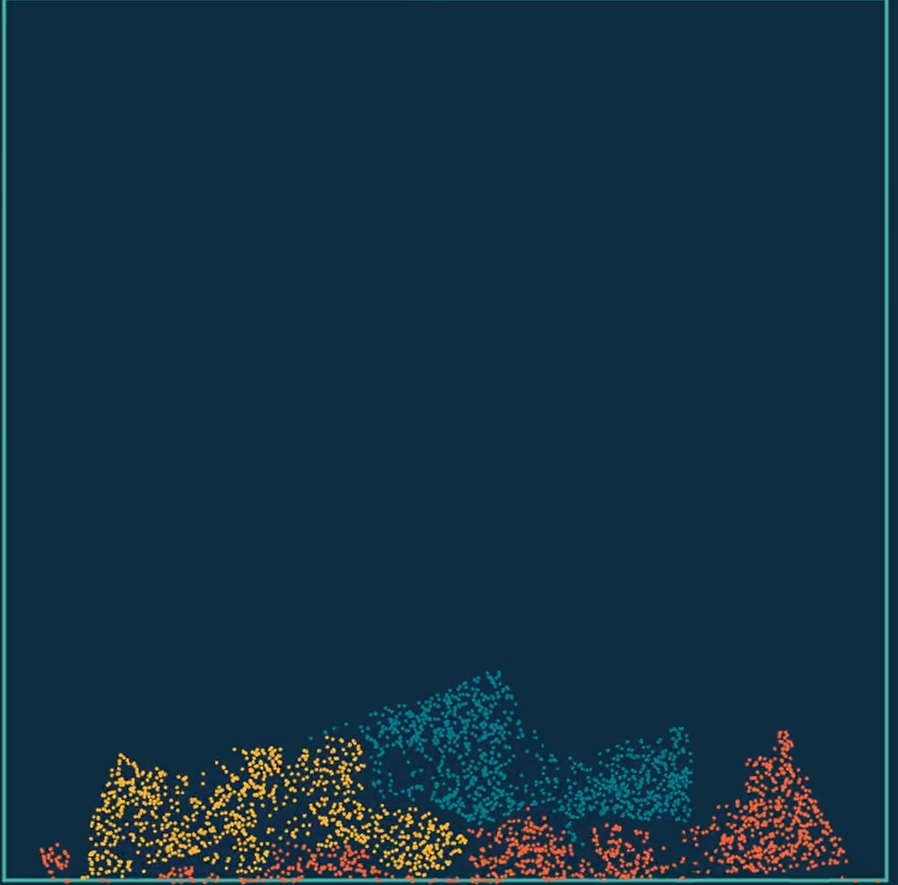
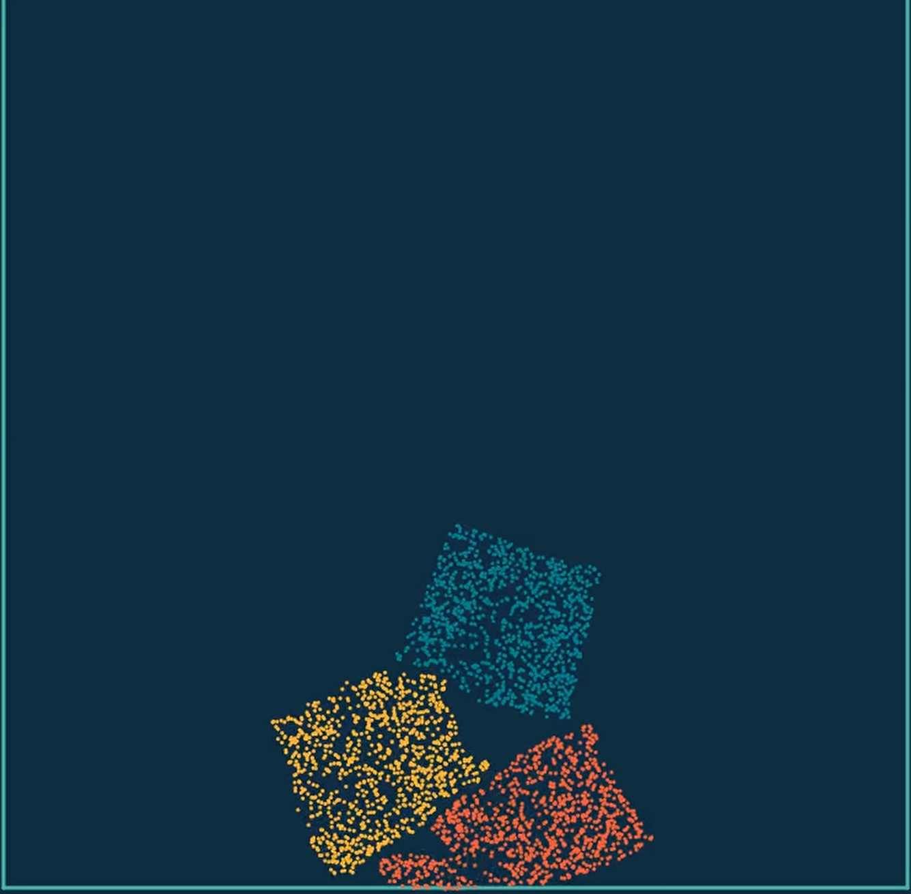

## USTC CG Lab7 基于 Taichi 的仿真

by PB1711172 李缙

### 一、实验内容

- 构建不同的模拟场景
  - 调整方块位置、大小
  - 调整背景颜色
  - 构建水池结构
- 探究参数空间：通过调整不同的参数设置体会不同参数对仿真结果的影响
  - 修改弹性物块的位置、质量，查看浮力作用
  - 修改杨氏模量，探究其对仿真结果的影响
- 探究其他算法和模型：通过改变物理模型、改变模拟算法实现新的模拟结果
  - 构建了探究浮力对于弹性物块作用的场景

### 二、实现及结果

- 在example2中，更改雪块的杨氏模量和硬度，探究其影响，结果如下对比图

  杨氏模量为1e2：

  杨氏模量为1e3：

  

  杨氏模量为1e4：

  硬度改为5：        

  

- 增加了水池对象的构建：

  ```cpp
  void add_object_pool(int c) {
      for (int i = 0; i < 5000; i++) {
          Vec pos = Vec::rand() * 1.0_f;
          Vec pos1((pos.x - 0.5_f) * 0.9_f, pos.y * 0.45_f);
          particles.push_back(Particle(pos1 + Vec(0.5, 0.05), c, Vec(0.0), 0));
      }
  }
  // 水池的高不超过0.5，宽是全部的(0.05, 0.95)
  ```

- 更改了背景颜色、物块颜色、质量、横坐标、下降高度，分别有不同的模拟效果，具体见视频，参数已在视频名中标出。

### 三、实验总结

非常感谢老师和助教带大家体验最前沿的框架，taichi 完成的水平很高，我本想安装3d的版本，但是cmake过程中发现要求的是vs2017，由于太忙只能暂时作罢，后续我会在linux上安装尝试。

在这次实验中，我对于现代最新的模拟过程有了更详细的了解，激发了我极大的兴趣。

感谢助教提供的几个样例，直观易懂，非常有帮助！