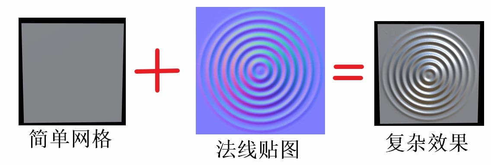
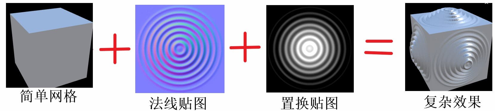
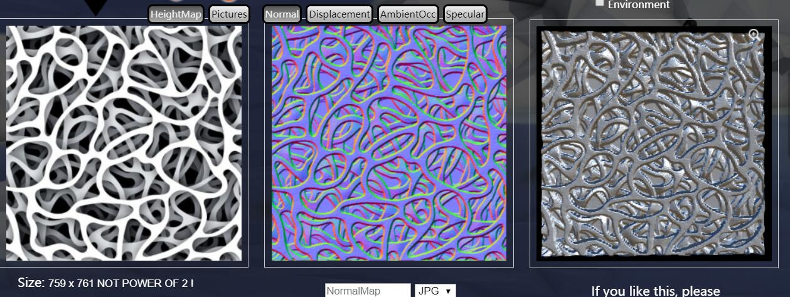
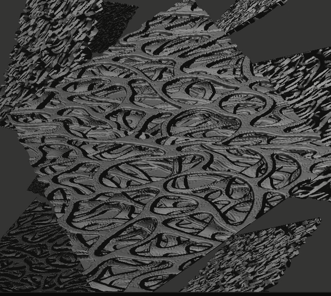
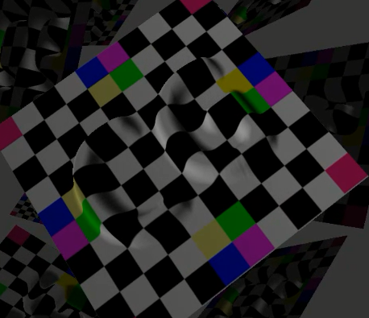

# USTC-CG Lab 8 着色器

PB17111572 李缙

### 一、实验大纲

- 实现 normal map 和 displacement map
- 利用 displacement map 在 vertex shader 中进行简单降噪
- 实现点光源阴影

### 二、实验内容及实现方法

#### （一）法向贴图

- 法线贴图在渲染中用于改变原法向，从而影响着色效果。

- 法线贴图中的法线向量定义在切线空间中，法线指向 z 方向。因此应使用一个特定的矩阵将本地/切线空间中的法线向量转成世界或物体空间下，总之是和贴图表面的法向处于相同空间。
- 在顶点着色器中计算 TBN 矩阵，在片段着色器中使用 TBN 矩阵把切线坐标空间的向量转换到物体坐标空间(Object Space)。

#### （二）置换贴图

- 置换贴图用于改变顶点的位置，0 （黑色）表示不动，1（白色）表示沿着法向偏移。

- 将置换贴图的值转换成顶点偏移量

  displacement = lambda * (-1 + 2 * pixel value)

- 由于置换贴图只改变了顶点的位置，不改变顶点的法向，所以应添加相应的法线贴图。

#### （三）置换贴图去噪

##### （i）去噪算法

- 虽然给顶点加了噪声，但法线还是用了原本的，所以含噪声模型在渲染的不同主要体现在纹理的扭曲和边缘的凹凸不平上。我们只需将顶点进行合理的偏移。
- 计算每个顶点的偏移量

$$
\delta_i=p_i-\frac{1}{|N(i)|}\sum_{j\in N(i)}p_j
$$

- 将偏移量投影到法向上

$$
\bar{\delta}_i=\langle\delta_i,\pmb{n}_i\rangle \pmb{n}_i
$$

- 对每一个顶点进行偏移

$$
\bar{p}_i=p_i-\lambda \bar{\delta}_i=p_i-\lambda\langle\delta_i,\pmb{n}_i\rangle \pmb{n}_i
$$

- 将 $\langle\delta_i,\pmb{n}_i\rangle$ 存到置换贴图中，并设置好 bias 和 scale 将值变换到 0 和 1 之间。

##### （ii）使用 KNN 算法插值

由于模型的顶点数远小于 1024 * 1024，这会造成置换贴图非常稀疏，在采样过程中便会出现误差。故采用 ANN 库的 K 近邻算法进行插值，构造完整的置换贴图。

**（iii) 去除缝隙（难点）**

在上述步骤完成后，查看结果发现在牛的身上出现了很多缝隙，分析后得知，这是由于存在以下情况导致的：

$\exist i != j, \ \ position[i] = position[j],\ \  normal[i] != normal[j] $

在这种情况下，我提出了三种办法来解决问题：

1. 考虑所有坐标相同但指标不同的重复点集，对每个重复点集，更改该位置上所有点的法向，为什么要这样更改？因为当前 normal[i] 是 i 点的 One ring 邻接三角形的法向平均，这没有考虑到 j 的 One ring。所以更改的方法为：

   $ normal[i] = normal[j] = \frac{N_i\times normal[i] + N_j\times normal[j]}{N_i + N_j} $

2. 但是不幸的是，normal 在框架中不可更改，于是第二个方法是：对每个重复点集，将其中所有点对应的displacement都记为0，然后对每个点集，向 normal 和 positions 后 push 一个新的法向和位置，位置不变，法向的计算方法如上。这种方法的问题在于，我们需要给新的点赋新的纹理坐标，而不能使用原来的，否则无法求出新的displacement，也有点麻烦。

3. 我们可以折中一下，考虑在计算偏移量的时候，更改以下公式：
   $$
   \delta_i=p_i-\frac{1}{|N(i)|}\sum_{j\in N(i)}p_j
   $$
   
   此时，公式里只考虑了 i 的 One ring，而如果我们考虑 i 点对应的重复点集中的所有邻接点，我们会发现——多数的法向相对的分量都能抵消掉！如此一来，我们也就很好地近似解决了这个问题。
   
   实际的效果是非常不错的，可以参见附带的视频。

#### （四）点光源阴影

##### 	(i)阴影映射

以光的位置为视角进行渲染，能看到的东西都将被点亮，看不见的一定是在阴影之中了。假设有一个地板，在光源和它之间有一个大盒子。由于光源处向光线方向看去，可以看到这个盒子，但看不到地板的一部分，这部分就应该在阴影中。

如果绘制一条从光源出发，到达最右边盒子上的一个片段上的线段或射线，那么射线将先击中悬浮的盒子，随后才会到达最右侧的盒子。结果就是悬浮的盒子被照亮，而最右侧的盒子将处于阴影之中。

得到射线第一次击中的那个物体，然后用这个最近点和射线上其他点进行对比。然后测试一下看看射线上的其他点是否比最近点更远，如果是的话，这个点就在阴影中。

从光源的透视图来渲染场景，并把深度值的结果储存到纹理中

通过储存到深度贴图中的深度值，就能找到最近点，用以决定片段是否在阴影中。我们使用一个来自光源的视图和投影矩阵来渲染场景就能创建一个深度贴图。这个投影和视图矩阵结合在一起成为一个$T$变换，它可以将任何三维位置转变到光源的可见坐标空间。

##### (ii)深度贴图

深度贴图是从光的透视图里渲染的深度纹理，用它计算阴影。

为光源使用正交投影矩阵，同时为了创建一个视图矩阵来变换每个物体，把它们变换到从光源视角可见的空间中，使用 look_at 函数；这次从光源的位置看向场景中央。二者相乘便得到了光空间的变换矩阵 lightSpaceMatrix，它将每个世界空间坐标变换到光源处所见到的那个空间。

顶点着色器将一个单独模型的一个顶点，使用 lightSpaceMatrix 变换到光空间中。

##### (iii)渲染阴影

- 在片段着色器中执行，用来检验一个片段是否在阴影之中
- 把光空间片段位置转换为裁切空间的标准化设备坐标，自己做透视除法` fragPosLightSpace.xyz / fragPosLightSpace.w;`
- 根据投影坐标，我们就能从深度贴图中采样得到0到1的结果，从第一个渲染阶段的 projCoords 坐标直接对应于变换过的NDC坐标。我们将得到光的位置视野下最近的深度
- 投影向量的 z 坐标是片段的当前深度。
- 检查 currentDepth 是否高于 closetDepth，如果是，那么片段就在阴影中。

##### (iv)阴影失真

图片中有明显的线条样式

因为阴影贴图受限于分辨率，在距离光源比较远的情况下，多个片段可能从深度贴图的同一个值中去采样。

用阴影偏移来解决这个问题，简单的对表面的深度应用一个偏移量，这样片段就不会被错误地认为在表面之下了。

##### (v)采样过多

由于光的视锥不可见的区域一律被认为是处于阴影中，不管它真的处于阴影之中，若投影向量的 z 坐标大于1.0，就将 shadow 的值强制设为0.0

##### (vi)柔和阴影处理

深度贴图有固定的分辨率，多个片段对应于一个纹理像素。多个片段会从深度贴图的同一个深度值进行采样，得到的是同一个阴影，于是就会产生锯齿边。

从深度贴图中多次采样，每一次采样的纹理坐标都稍有不同。每个独立的样本可能在也可能不再阴影中。所有的次生结果接着结合在一起，进行平均化，就得到了柔和阴影。

### 三、实验结果

##### （一）法向贴图和置换贴图

我在附带的网站中自己生成了一副图，网站上生成的图如下：

而我的程序运行结果如下：

可见效果基本一致。

原版的CG图，运行结果如下：

##### （二）置换贴图去噪

##### （三）点光源阴影

这两部分都是视频效果较好，请助教移步同级文件夹查看。

### 四、实验感想

本次实验学习了OpenGL的用法，对管线有了更好的理解，其中在做第二部分的去缝隙用了很多时间，做了很多种尝试，感觉收获满满。谢谢老师的耐心讲解和助教的耐心答疑，感谢提供如此高质量的框架，实验体验极好！